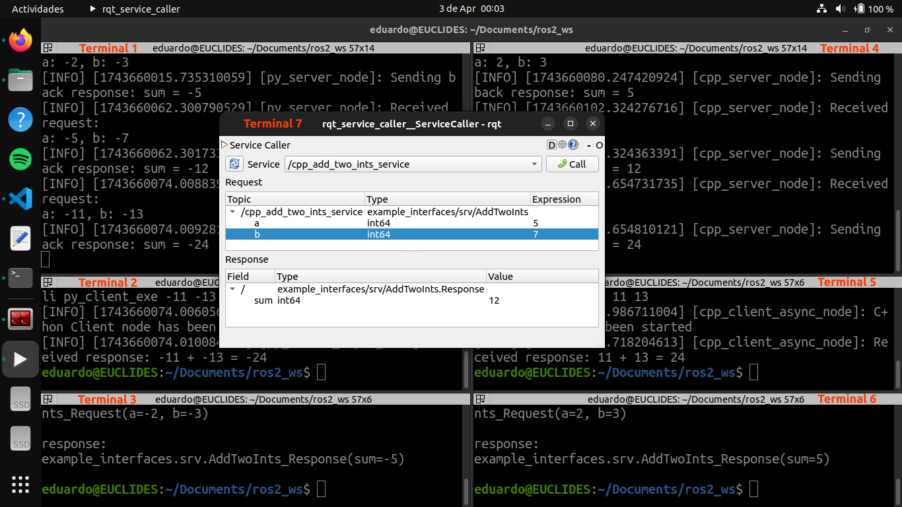
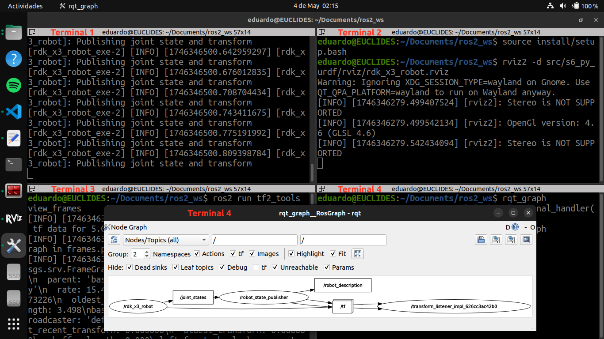

# ROS 2 Course Repository

- **Author:** Eduardo de Jesús Dávila Meza, Ph.D.
- **Email:** [eduardodavila94@hotmail.com](mailto:eduardodavila94@hotmail.com)
- **LinkedIn:** [EduardoDavila-AI](https://www.linkedin.com/in/eduardodavila-ai/)
- **HackerRank:** [eduardodavila94](https://www.hackerrank.com/profile/eduardodavila94)

Official repository for the ROS 2 course taught at Tecnológico de Monterrey, Campus Guadalajara. This course is designed for students in the *Robotics and Intelligent Systems Engineering* program and aims to provide a solid foundation in the use and development of ROS 2 Humble applications.

# Instructions to launch the ROS 2 Packages

Here's the LaTeX content you provided converted to **Markdown** format, suitable for a GitHub `README.md` file:

---

## 1. Running ROS 2 Examples

### Examples to Try

#### Talker-Listener

After installing `ros-humble-desktop` (and optionally `Terminator`), try the following:

* In **Terminal 1**, source the setup file and run a C++ talker:

  ```bash
  source /opt/ros/humble/setup.bash
  ros2 run demo_nodes_cpp talker
  ```

* In **Terminal 2**, source the setup file and run a Python listener:

  ```bash
  source /opt/ros/humble/setup.bash
  ros2 run demo_nodes_py listener
  ```

You should observe that the talker publishes messages and the listener confirms their reception.

#### Turtlesim: Publish and Move a Turtle

Another example is provided by the `turtlesim` package:

* In **Terminal 3**, run the turtlesim node:

  ```bash
  ros2 run turtlesim turtlesim_node
  ```

* In **Terminal 4**, run the teleoperation node to control the turtle:

  ```bash
  ros2 run turtlesim turtle_teleop_key
  ```

Use the arrow keys to move the turtle. This example demonstrates publishing velocity commands to control the simulated turtle.

**Evidence:**

*Figure: Example screenshot showing terminal outputs from both the Talker-Listener example and the Turtlesim node example in action.*

## 2. Running ROS 2 Nodes

### Executing ROS 2 Publishers and Subscribers

#### Running the Python Publisher and Subscriber

After implementing and saving your Python nodes and updating `package.xml` and `setup.py` files, build your package and run the nodes. In two separate terminal sessions (or using the `Terminator` emulator), execute the following commands from the root of your workspace:

* **Terminal 1:** Build your package, source the setup file, and run the Python publisher node:

  ```bash
  colcon build --packages-select s2_py_pubsub
  source install/setup.bash
  ros2 run s2_py_pubsub publisher_exe
  ```

* **Terminal 2:** Source the setup file and run the Python subscriber node:

  ```bash
  source install/setup.bash
  ros2 run s2_py_pubsub subscriber_exe
  ```

You should observe that the `py_publisher` node sends a personalized message (e.g., displaying your name), and the `py_subscriber` node awaits the reception of the messages.

#### Running the C++ Publisher and Subscriber

After implementing and saving your C++ nodes and updating `package.xml` and `CMakeLists.txt` files, build your package and run the nodes. In two additional terminal sessions (or another two sessions in `Terminator`), execute the following commands from the root of your workspace:

* **Terminal 3:** Build your package, source the setup file, and run the C++ publisher node:

  ```bash
  colcon build --packages-select s2_cpp_pubsub
  source install/setup.bash
  ros2 run s2_cpp_pubsub publisher_exe
  ```

* **Terminal 4:** Source the setup file and run the C++ subscriber node:

  ```bash
  source install/setup.bash
  ros2 run s2_cpp_pubsub subscriber_exe
  ```

You should observe that the `py_publisher` node publishes your personalized message (e.g., displaying your name), and the `cpp_subscriber` node confirms its reception. Likewise, the `cpp_publisher` node publishes your other personalized message, and the `py_subscriber` node confirms its reception.

#### Visualizing the ROS Graph with `rqt_graph`

To ensure that your publisher and subscriber nodes are correctly connected, use the `rqt_graph` tool. In **Terminal 5**, execute the following command (no need to enter your workspace directory):

```bash
ros2 run rqt_graph rqt_graph
```

or simply:

```bash
rqt_graph
```

This visualization should show the topics connecting your publisher and subscriber nodes.

**Evidence:**

*Figure: Example screenshot showing terminal outputs of the publisher and subscriber nodes, in C++ and Python, in action.*


## 3. Running ROS 2 Services and Clients

### Executing ROS 2 Services and Clients

#### Running the Python Service and Client

After implementing and saving your Python nodes and updating the `package.xml` and `setup.py` files, build your package and run the nodes. In three separate terminal sessions (or using the `Terminator` emulator), execute the following commands from the root of your workspace:

* **Terminal 1:** Build your package, source the setup file, and launch the Python service node:

  ```bash
  colcon build --packages-select s3_py_srvcli
  source install/setup.bash
  ros2 run s3_py_srvcli server_exe
  ```

* **Terminal 2:** Source the setup file and run the Python client node:

  ```bash
  source install/setup.bash
  ros2 run s3_py_srvcli client_exe -11 -13
  ```

* **Terminal 3:** Send a service request directly from the command line:

  ```bash
  ros2 service call /py_add_two_ints_service example_interfaces/srv/AddTwoInts "{a: -2, b: -3}"
  ```

You should observe that the `py_server` node processes service requests from both the `py_client` node and the command-line client in Terminal 3.

#### Running the C++ Service and Client

After implementing and saving your C++ nodes and updating the `package.xml` and `CMakeLists.txt` files, build your package and run the nodes. In three additional terminal sessions (or three new sessions in `Terminator`), execute the following commands from the root of your workspace:

* **Terminal 4:** Build your package, source the setup file, and launch the C++ service node:

  ```bash
  colcon build --packages-select s3_cpp_srvcli
  source install/setup.bash
  ros2 run s3_cpp_srvcli server_exe
  ```

* **Terminal 5:** Source the setup file and run the C++ client node:

  ```bash
  source install/setup.bash
  ros2 run s3_cpp_srvcli client_exe 11 13
  ```

* **Terminal 6:** Send a service request directly from the command line:

  ```bash
  ros2 service call /cpp_add_two_ints_service example_interfaces/srv/AddTwoInts "{a: 2, b: 3}"
  ```

You should observe that the `cpp_server` node processes service requests from both the `cpp_client` node and the command-line client in Terminal 6.

#### Requesting a Service Using `rqt_service_caller`

Use the `rqt_service_caller` tool to send service requests to both the Python and C++ servers. In **Terminal 7**, run:

```bash
ros2 run rqt_service_caller rqt_service_caller
```

Then, request a service call for:

* `/py_add_two_ints_service` with the values `a: -5`, `b: -7`
* `/cpp_add_two_ints_service` with the values `a: 5`, `b: 7`

You should observe that the `py_server` and `cpp_server` nodes successfully process the service requests sent via `rqt_service_caller`.

**Evidence:**

*Figure: Example screenshot showing terminal outputs from the servers and clients in action.*


## 4. ROS 2 Custom `.msg` and `.srv` Files

### Executing ROS 2 Publishers, Subscribers, Services, and Clients

After editing and saving your custom `.msg` and `.srv` files, and updating your C++ and Python nodes along with `CMakeLists.txt`, `setup.py`, and `package.xml`, build the packages:

```bash
colcon build --packages-select s4_custom_interface
colcon build --packages-select s4_cpp_apps
colcon build --packages-select s4_py_apps
```

Then, in **eight separate terminal sessions** (or using the `Terminator` emulator), source your ROS 2 workspace in each terminal and run the nodes as follows:

* **Terminal 1:** Run the Python publisher node:

  ```bash
  source install/setup.bash
  ros2 run s4_py_apps publisher_exe
  ```

* **Terminal 2:** Run the Python subscriber node:

  ```bash
  source install/setup.bash
  ros2 run s4_py_apps subscriber_exe
  ```

* **Terminal 3:** Run the Python server node:

  ```bash
  source install/setup.bash
  ros2 run s4_py_apps server_exe
  ```

* **Terminal 4:** Run the Python client node:

  ```bash
  source install/setup.bash
  ros2 run s4_py_apps client_exe -2 -3 -5
  ```

* **Terminal 5:** Run the C++ publisher node:

  ```bash
  source install/setup.bash
  ros2 run s4_cpp_apps publisher_exe
  ```

* **Terminal 6:** Run the C++ subscriber node:

  ```bash
  source install/setup.bash
  ros2 run s4_cpp_apps subscriber_exe
  ```

* **Terminal 7:** Run the C++ server node:

  ```bash
  source install/setup.bash
  ros2 run s4_cpp_apps server_exe
  ```

* **Terminal 8:** Run the C++ client node:

  ```bash
  source install/setup.bash
  ros2 run s4_cpp_apps client_exe 2 3 5
  ```

You should observe the following:

1. The `py_publisher` node publishes the custom `HardwareStatus` and `Sphere` messages.
2. The `py_subscriber` node receives the `HardwareStatus` message from the `cpp_publisher` and the `Sphere` message from the `py_publisher`.
3. The `py_server` node processes the service request from the `py_client` node.
4. The `cpp_publisher` node publishes the custom `HardwareStatus` and `Sphere` messages.
5. The `cpp_subscriber` node receives the `HardwareStatus` message from the `py_publisher` and the `Sphere` message from the `cpp_publisher`.
6. The `cpp_server` node processes the service request from the `cpp_client` node.

---

### Visualizing the ROS Graph with `rqt_graph`

To verify that all nodes are correctly connected, use the `rqt_graph` tool.

In **Terminal 9**, run:

```bash
ros2 run rqt_graph rqt_graph
```

or simply:

```bash
rqt_graph
```

This will display a graph of all publishers, subscribers, and services, confirming proper communication and node topology.

**Evidence 1:**

*Figure: Example screenshot showing terminal outputs of the publishers, subscribers, services, and clients, in C++ and Python, in action.*

**Evidence 2:**

*Figure: Example screenshot showing the ROS 2 graph of the publisher, subscriber, and service nodes.*


## 5. ROS 2 Parameters, YAML, and Launch Files (Image Acquisition)

### Executing ROS 2 Image Publishers and Subscribers

After editing and saving your C++ and Python nodes, and updating the `CMakeLists.txt`, `setup.py`, and `package.xml` files, build the packages:

```bash
colcon build --packages-select s5_cpp_camera
colcon build --packages-select s5_cpp_camera_usr
colcon build --packages-select s5_py_camera
colcon build --packages-select s5_py_camera_usr
```

Then, in **three separate terminal sessions** (or using the `Terminator` emulator), source your ROS 2 workspace in each terminal and run the following:

* **Terminal 1:** Run either the C++ or Python image publisher node:

  ```bash
  source install/setup.bash
  ros2 run s5_cpp_camera camera_exe
  ```

* **Terminal 2:** Run the C++ image subscriber node:

  ```bash
  source install/setup.bash
  ros2 run s5_cpp_camera_usr camera_usr_exe
  ```

* **Terminal 3:** Run the Python image subscriber node:

  ```bash
  source install/setup.bash
  ros2 run s5_py_camera_usr camera_usr_exe
  ```

You should observe that:

1. The `cpp_camera` or `py_camera` node publishes the image message.
2. Both `cpp_camera_usr` and `py_camera_usr` nodes receive the image message.

---

### Visualizing the Image Topic with `rqt_image_view`

To verify that the publisher is correctly publishing the image topic, use:

```bash
ros2 run rqt_image_view rqt_image_view
```

This will display the image stream from either the C++ or Python image publisher node.

---

### Visualizing the ROS Graph with `rqt_graph`

To ensure that the publisher and subscriber nodes are correctly connected, run in a new terminal:

```bash
ros2 run rqt_graph rqt_graph
```

Or simply:

```bash
rqt_graph
```

This will show the image topic being published and subscribed to, confirming proper ROS 2 graph connectivity.

**Evidence 1:**

*Figure: Example screenshot showing terminal outputs of the publisher and subscribers, in C++ and Python, in action.*

**Evidence 2:**

*Figure: Example screenshot showing the image windows and the ROS 2 graph of the publisher and subscriber nodes.*


## 6. Practice Assignment: URDF Modeling and Launch Files (Robot States)

### Executing ROS 2 Robot State Publishers

After editing and saving your C++ and Python nodes, and updating the `CMakeLists.txt`, `setup.py`, and `package.xml` files, build the packages:

```bash
colcon build --packages-select s6_cpp_urdf
colcon build --packages-select s6_py_urdf
```

Then, in two terminals, source the workspace environment and run:

* **Terminal 1:** Launch the robot state publisher node (C++ or Python):

  ```bash
  source install/setup.bash
  ros2 launch s6_py_urdf rdk_x3_robot_launch.py
  ```

* **Terminal 2:** Launch RViz with the provided configuration file:

  ```bash
  source install/setup.bash
  rviz2 -d src/s6_py_urdf/rviz/rdk_x3_robot.rviz
  ```

You should observe:

1. The `robot_state_publisher` node publishing the URDF model and TFs.
2. The `rdk_x3_robot` node publishing joint states for dynamic updates in RViz.

---

### Visualizing the Frames with `view_frames`

To view the coordinate frame hierarchy, run:

```bash
ros2 run tf2_tools view_frames
```

This will generate a PDF file in the current directory, showing the TF tree published by the robot's `robot_state_publisher` node.

---

### Visualizing the ROS Graph with `rqt_graph`

To verify that the robot state publisher nodes are correctly connected, use:

```bash
ros2 run rqt_graph rqt_graph
```

Or simply:

```bash
rqt_graph
```

This will show the `joint_states` topic and how the publisher nodes are linked.


**Evidence 1:**

*Figure: Example screenshot showing terminal outputs and the ROS 2 graph of the robot state publishers in action.*

**Evidence 2:**

*Figure: PDF showing the graphical representation of the current coordinate frame tree.*

**Evidence 3:**

*Figure: Example screenshot showing the simulation of the RDK X3 Robot in RViz.*


## 7. `tf2` Library (Robot Network)

### Executing ROS 2 Robot Status Publishers

After editing and saving the Python nodes and updating the `CMakeLists.txt`, `setup.py`, and `package.xml` files, build the packages:

```bash
colcon build --packages-select s7_robot_network_interface
colcon build --packages-select s7_py_task_manager
colcon build --packages-select s7_py_client_robot
colcon build --packages-select s7_py_robot_task_monitoring
```

Then, in **five terminals**, source your ROS 2 workspace in each and execute:

* **Terminal 1** – Run the pose server node:

  ```bash
  source install/setup.bash
  ros2 run s7_py_task_manager task_manager_exe
  ```

* **Terminal 2** – Launch the robot client node:

  ```bash
  source install/setup.bash
  ros2 launch s7_py_client_robot client_robots_launch.py
  ```

* **Terminal 3** – Launch pose/status sub-pub nodes:

  ```bash
  source install/setup.bash
  ros2 launch s7_py_robot_task_monitoring robot_network_launch.py
  ```

* **Terminal 4** – Launch RViz:

  ```bash
  source install/setup.bash
  rviz2 -d src/s7_py_robot_task_monitoring/rviz/robot_network.rviz
  ```

* **Terminal 5** – Run the robot status logger:

  ```bash
  source install/setup.bash
  ros2 run s7_py_robot_task_monitoring robot_status_logger_exe
  ```

You should observe:

1. The `task_manager` node processing service requests from the `robot1` client.
2. The `cylinder1/robot_state_publisher` and `cylinder2/robot_state_publisher` publishing pickup/delivery poses.
3. The `robot1/robot_state_publisher` broadcasting robot1’s URDF model and TFs.
4. The `cylinders` node broadcasting TFs for pickup and delivery poses.
5. The `robots` node publishing robot1’s status and joint states.
6. The `robot_status_logger` node printing the robot status when data is received.

---

### Visualizing the Frame Tree with `view_frames`

To observe the current frame hierarchy, use:

```bash
ros2 run tf2_tools view_frames
```

This generates a PDF file in the current terminal directory, representing the current TF tree.

---

### Visualizing the ROS Graph with `rqt_graph`

To verify the node connections, run:

```bash
ros2 run rqt_graph rqt_graph
```

Or:

```bash
rqt_graph
```

This shows the connections between all publishers, subscribers, services, and clients in the robot network.

**Evidence 1:**

*Figure: Example screenshot showing terminal outputs and the ROS 2 graph of the robot network in action.*

**Evidence 2:**

*Figure: PDF showing the graphical representation of the current coordinate frame tree.*

**Evidence 3:**

*Figure: Example screenshot showing the visualization of the RDK X3 `Robot1` in RViz.*


## 8. Occupancy Grid Map (SLAM Simulation)

### Executing ROS 2 SLAM Simulation

After editing the Python nodes and updating `CMakeLists.txt`, `setup.py`, and `package.xml`, build the package:

```bash
colcon build --packages-select s8_py_slam
```

Then, in **five separate terminals**, source your workspace and run:

* **Terminal 1** – Launch the robot in Gazebo:

  ```bash
  source install/setup.bash
  ros2 launch s8_py_slam spawn_robot_launch.py
  ```

* **Terminal 2** – Display robot in RViz:

  ```bash
  source install/setup.bash
  ros2 launch s8_py_slam display_robot_launch.py
  ```

* **Terminal 3** – Start the SLAM node (with simulation time):

  ```bash
  source install/setup.bash
  ros2 launch slam_toolbox online_async_launch.py use_sim_time:=True
  ```

* **Terminal 4** – Run the pose publisher node:

  ```bash
  source install/setup.bash
  ros2 run s8_py_slam pose_publisher_exe
  ```

* **Terminal 5** – Run the teleop node (to control the robot):

  ```bash
  source install/setup.bash
  ros2 run teleop_twist_keyboard teleop_twist_keyboard
  ```

You should observe:

1. The robot URDF model is spawned in Gazebo with a LiDAR plugin.
2. The `robot_state_publisher` node visualizes the robot in RViz.
3. An occupancy grid is built and displayed through the `/map` topic in RViz as the robot explores the environment.

---

### Visualizing Frame Tree with `view_frames`

To generate a TF frame tree PDF:

```bash
ros2 run tf2_tools view_frames
```

This creates a `frames.pdf` in the current directory.

---

### Visualizing the ROS Graph with `rqt_graph`

To check node and topic connections:

```bash
ros2 run rqt_graph rqt_graph
```

Or simply:

```bash
rqt_graph
```

This displays the complete ROS 2 graph for the SLAM setup.


**Evidence 1:**

*Figure: Terminal outputs and ROS 2 graph of the SLAM simulation.*

**Evidence 2:**

*Figure: PDF showing the current coordinate frame tree.*

**Evidence 3:**

*Figure: Simulation of the RDK X3 Robot in Gazebo.*

**Evidence 4:**

*Figure: Visualization of the RDK X3 Robot in RViz.*


